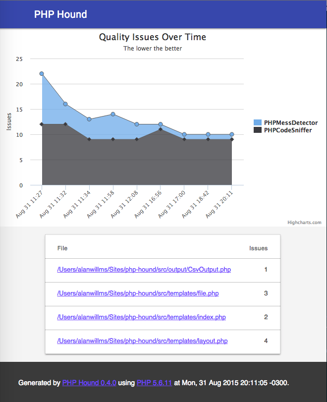

# PHP Hound

[](https://travis-ci.org/alanwillms/php-hound)
[](https://codeclimate.com/github/alanwillms/php-hound)
[](https://scrutinizer-ci.com/g/alanwillms/php-hound/?branch=master)
[](https://codeclimate.com/github/alanwillms/php-hound/coverage)
[](https://packagist.org/packages/alanwillms/php-hound)
[](https://packagist.org/packages/alanwillms/php-hound)

**This is a work in progress!**

PHP Hound runs a set of quality assurance tools for PHP and reduce results to
a single beautiful report.

It currently supports:

* [PHPCodeSniffer](https://github.com/squizlabs/PHP_CodeSniffer): code style and
  identation according to [PSR-2](http://www.php-fig.org/psr/psr-2/).
* [PHPCopyPasteDetector](https://github.com/sebastianbergmann/phpcpd):
  duplicated code detection.
* [PHPMessDetector](https://github.com/phpmd/phpmd): checks for complex, unused,
  broken or unclear code.



## Installation

PHP Hound can be installed through [Composer](https://getcomposer.org).

### Local installation

To install it locally, run the following command:

```bash
composer require alanwillms/php-hound
```

Then you can execute PHP Hound by running `./vendor/bin/php-hound`.

### Global installation

You can install PHP Hound globally with:

```bash
composer global require alanwillms/php-hound
```

Then you can add `~/.composer/bin` directory to your `PATH`, so you can
simply type `php-hound` to run it from anywhere. If you want to do this,
add the following to your `~/.profile` (or `~/.bashrc`) file:

```bash
export PATH="$HOME/.composer/vendor/bin:$PATH"
```

If you want to apply the changes to your current terminal session, run
`source ~/.profile` (or `source ~/bashrc`).

## Command line usage
Basic usage:

```bash
# Analyze current directory files
php-hound

# Analyze "informed/directory/" files
php-hound informed/directory/

# Analyze "script.php" file
php-hound script.php
```

You can run `php-hound --help` to display a list of all available options.

```
php-hound [optional arguments] [path to be analysed]

Optional Arguments:
	-f format, --format format (default: text)
		Output format
	-h, --help
		Prints a usage statement
	-i ignore, --ignore ignore (default: vendor,tests,features,spec)
		Ignore a comma-separated list of directories
	-v, --version
		Prints installed version
```

## Gradually fix legacy code

If you have a huge base of legacy code, it's really hard to fix all code issues
at the same time, in a single commit.

PHP Hound helps you to gradually fix your code by only warning about issues
found in the files and lines touched by a branch or commit. All other files
or lines will be ignored.

That's pretty easy to achieve:

```bash
# Usage:
# php-hound --git-diff <commits or branches to compare> <target directory>

# Only return issues found on lines and files changed on the "windows10" branch:
php-hound --git-diff master..windows10 /path/to/git/repo

# Only return issues found on lines and files changed between two commits
php-hound --git-diff b28a1df..4fff883 /path/to/git/repo
```
